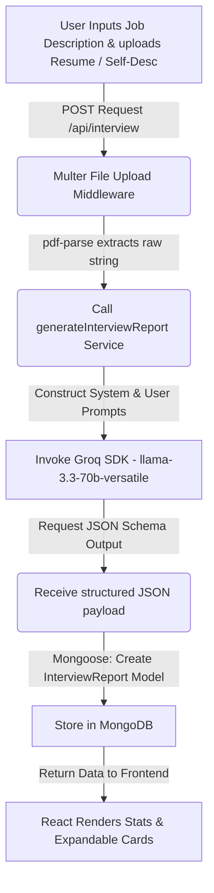
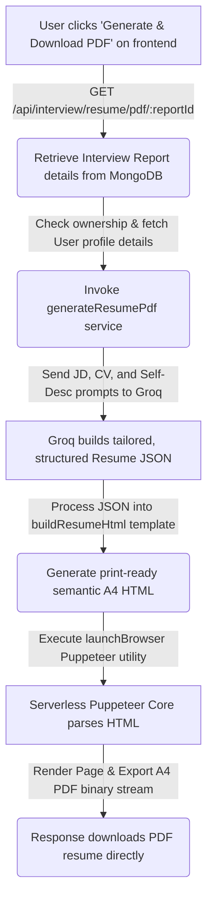

# 🧠 Interview AI (MERN Stack)

[](https://interview-ai-mern-stack-frontend.vercel.app/)
[](https://interview-ai-mern-stack-web.vercel.app/)
[](https://groq.com/)
[](https://www.mongodb.com/)
[](https://pptr.dev/)

An advanced AI-powered preparation ecosystem built on the **MERN Stack** (MongoDB, Express, React, Node.js) and powered by **Groq (`llama-3.3-70b-versatile`)**. It acts as a virtual Technical Interviewer and Career Coach to analyze target Job Descriptions alongside candidate Resumes to generate comprehensive preparation reports and tailor resumes into print-ready A4 PDFs.

---

## 🔗 Live Application Links
- **Frontend Dashboard:** [https://interview-ai-mern-stack-frontend.vercel.app/](https://interview-ai-mern-stack-frontend.vercel.app/)
- **Backend API Endpoint:** [https://interview-ai-mern-stack-web.vercel.app/](https://interview-ai-mern-stack-web.vercel.app/)

---

## 🚀 Core Features

### 1. AI-Driven Interview Preparation Reports
- **Profile Match Score:** Computes an alignment score (0-100) using custom-engineered prompts assessing how well the candidate fits the job requirements.
- **Custom Technical Questions:** Generates 5-6 conceptual, algorithmic, or system design interview questions custom-tailored to the overlap between the CV and Job Description.
- **Ideal Answers & Key Points:** Evaluates expected conceptual details and structures target answers.
- **Behavioral Prompts (STAR Method):** Outlines specific behavioral questions and structures their ideal answers in the **Situation, Task, Action, and Result** format.
- **Skills Gaps Identification:** Highlights missing requirements, labeling them with **Low, Medium, or High severity**.
- **Actionable Prep Plans:** Creates order-based preparation schedules with recommended study materials and links.

### 2. One-Click AI Resume Customizer & A4 PDF Generator
- **Auto-Tailoring:** Rewrites the professional summary and project bullets matching the keywords in the Job Description.
- **Metrics & Action Verbs Integration:** Enforces the use of action verbs (e.g., *Led, Optimized, Restructured*) and formats accomplishments with quantifiable results.
- **Zero Fabrication Policy:** Extracts and tailors *only* the facts present in the raw CV or self-description without inventing metrics, credentials, or work experience.
- **Serverless PDF Compiler:** Employs Puppeteer to render a styled, print-ready, grid-aligned A4 resume template and compiles it into a downloadable binary PDF buffer.

### 3. Dynamic User Portal & Session Tracking
- **JWT Authorization:** Uses JSON Web Tokens saved in HTTP-only, secure, same-site cookies (with fallback to auth headers for cross-origin setups).
- **Token Blacklisting:** Maintains database-backed session termination on logouts.
- **Report Repository Dashboard:** Lists past prep sessions with match ratings and quick-access pathways.

---

## 🛠️ Tech Stack & Architecture

### Frontend (Client-Side)
- **Framework:** React 19 (Vite)
- **Routing:** React Router v7
- **Styling:** Vanilla CSS compiled with **Sass (SCSS)** for custom premium layouts.
- **State Management:** React Context API (`AuthContext` and `InterviewContext`).
- **HTTP Client:** Axios with credentials handling and authorization headers.

### Backend (Server-Side)
- **Runtime Environment:** Node.js
- **Server Framework:** Express.js (MVC routing structure)
- **Database Model ORM:** Mongoose (MongoDB Atlas integration)
- **Authentication:** JSON Web Tokens (JWT) + Bcrypt.js password encryption.
- **Middleware Layers:**
  - `auth.middleware.js`: Restricts private API scopes and handles token validation.
  - `file.middleware.js`: Multer interface managing in-memory resume file uploads (max 3MB limit).
- **AI Core Interfacing:** Groq SDK + Custom prompt templates.

---

## ⚡ System Flow & Working Logic

### A. Interview Preparation Report Pipeline


### B. Resume Tailoring & PDF Generation Pipeline


---

## 📁 Folder Structure

```
interview-ai-mern-stack/
├── backend/
│   ├── api/
│   ├── src/
│   │   ├── config/             # Database connection routines
│   │   ├── controllers/        # Express route handlers
│   │   ├── middlewares/        # Authentication, File upload validation
│   │   ├── models/             # User, InterviewReport, Blacklist schemas
│   │   ├── routes/             # REST route entrypoints
│   │   └── services/           # Groq APIs, Puppeteer browser launchers
│   ├── server.js               # Entry-point bootstrap script
│   ├── vercel.json             # Vercel Serverless hosting configurations
│   └── package.json            # Node configurations and dependencies
└── frontend/
    ├── public/
    ├── src/
    │   ├── components/         # Shared layouts, Loader widgets
    │   ├── features/
    │   │   ├── auth/           # Contexts, Forms, and hooks for users
    │   │   └── interview/      # Dashboards, reports, and PDF generators
    │   ├── lib/                # Shared Axios initialization config
    │   ├── App.jsx             # React component entrypoint
    │   ├── main.jsx            # DOM mounting target
    │   └── style.scss          # Core styling entry point
    ├── vite.config.js          # Build tool settings
    ├── vercel.json             # Frontend redirect configuration
    └── package.json            # Frontend script dependencies
```

---

## 📡 REST API Specifications

### Authentication Routing (`/api/auth`)

| Endpoint | Method | Access | Request Body | Description |
| :--- | :--- | :--- | :--- | :--- |
| `/register` | `POST` | Public | `{ username, email, password }` | Registers user, hashes password, saves record, and issues cookie token. |
| `/login` | `POST` | Public | `{ email, password }` | Authenticates details, signs JWT, and responds with cookie token. |
| `/logout` | `GET` | Public | *None* | Appends token to database blacklist and clears cookie. |
| `/get-me` | `GET` | Private | *None* | Retrieves identity details of active token carrier. |

### Interview Preparation Routing (`/api/interview`)

| Endpoint | Method | Access | Request Body | Description |
| :--- | :--- | :--- | :--- | :--- |
| `/` | `POST` | Private | Form-Data: `jobDescription` (text), `selfDescription` (text), `resume` (PDF file) | Extracts text, calls Groq, saves to MongoDB, returns complete report. |
| `/` | `GET` | Private | *None* | Returns summaries of all reports for user dashboard history. |
| `/report/:id` | `GET` | Private | *None* | Returns complete preparation analysis report for a specific record ID. |
| `/resume/pdf/:reportId` | `GET` | Private | *None* | Triggers AI resume optimization and returns compiled PDF stream. |

---

## ⚙️ Serverless Puppeteer Implementation details

Hosting Puppeteer in a serverless environment like Vercel introduces a strict **50MB function bundle size limit**. This project overcomes this limit by utilizing **`puppeteer-core`** paired with **`@sparticuz/chromium-min`** in production:

1. **Lazy Loading**: Packages are imported dynamically only when PDF rendering is requested.
2. **External Binaries**: The backend downloads a lightweight, compressed version of Chromium from a GitHub CDN at runtime instead of packaging it inside the deployment bundle:
   ```javascript
   const CHROMIUM_URL = "https://github.com/Sparticuz/chromium/releases/download/v131.0.1/chromium-v131.0.1-pack.tar";
   ```
3. **Local Dev Fallback**: The server automatically falls back to local native Puppeteer when `process.env.NODE_ENV !== "production"`.

---

## 🔧 Installation & Local Setup

### Prerequisites
- Node.js installed (v18 or higher recommended).
- A MongoDB cluster or local MongoDB instance running.
- A **Groq API Key** (obtainable from [Groq Console](https://console.groq.com/)).

---

### Step 1: Configure Backend Environment
Navigate into the `backend/` directory, create a `.env` file based on `.env.example`, and fill in your variables:

```bash
PORT=3000
MONGO_URI=mongodb+srv://<username>:<password>@cluster.mongodb.net/interview_ai
JWT_SECRET=your_jwt_signing_secret_key
GROQ_API_KEY=gsk_your_groq_api_credential_key
FRONTEND_URL=http://localhost:5173
NODE_ENV=development
```

---

### Step 2: Install and Start Backend
```bash
cd backend
npm install
npm run dev
```
The server will boot up and log:
```
Server is running successfully on port 3000...
MongoDB connected successfully...
```

---

### Step 3: Configure Frontend Environment
Navigate to the `frontend/` directory, create a `.env` file, and assign the backend server URL:

```bash
VITE_API_URL=http://localhost:3000
```

---

### Step 4: Install and Start Frontend
```bash
cd ../frontend
npm install
npm run dev
```
Open [http://localhost:5173](http://localhost:5173) in your browser to experience the application locally.

---

## 🚢 Deployment (Vercel)

### Backend Configuration (`vercel.json`)
The backend is structured to deploy smoothly on Vercel as serverless functions.
```json
{
  "version": 2,
  "builds": [
    {
      "src": "server.js",
      "use": "@vercel/node"
    }
  ],
  "routes": [
    {
      "src": "/(.*)",
      "dest": "server.js"
    }
  ]
}
```

### Frontend Configuration (`vercel.json`)
The frontend uses standard client-side routing. To avoid router page reload 404s, Vercel is configured to route all incoming requests to `index.html`:
```json
{
  "rewrites": [
    { "source": "/(.*)", "destination": "/index.html" }
  ]
}
```

---

## 🔒 Security Best Practices
- **Credential Storage:** All user passwords are encrypted using Bcrypt.js with 10 salt rounds.
- **Cross-Origin Resource Sharing (CORS):** Fully restricted to approved staging/production domains.
- **Cookies & Sessions:** Session tokens are saved under httpOnly and Secure settings to mitigate XSS attacks.
- **Token Invalidation:** Blacklisted session keys are kept in MongoDB to invalidate expired authorization vectors.

---

## 📄 License
This project is licensed under the MIT License. Feel free to modify and build upon it!

---

**Developed for career growth and seamless interview preparations.** 🚀
